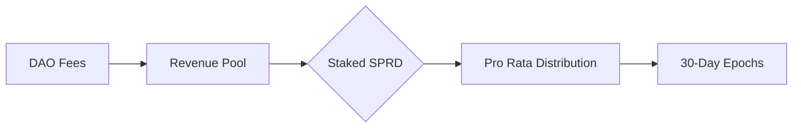

# What is Spreadly?

Spreadly revolutionizes decentralized asset management by combining structured capital formation with flexible DAO governance. The protocol enables creation of investment vehicles that balance decentralized control with professional-grade portfolio management.

## Management Structures

Spreadly empowers organizations with flexible management options through purpose-built contracts that cater to different operational needs:

**Single Admin -** A streamlined structure perfect for individual portfolio managers, featuring:
- Full treasury control through a single wallet address
- Seamless trade execution with automated fee collection
- Fair profit sharing between the trading admin and DAO token stakers
- Emergency disbandment voting, ensuring DAO token stakers can recover equitable shares of the treasury

**Multi-Admin -** Designed for collaborative investment teams that need shared control:
- Equal trading privileges across multiple admin addresses
- Automated fee distribution to trade executors
- Equitable profit sharing with DAO token stakers
- Protected by emergency voting and distribution, just as Single Admin DAOs

**Governance Based -** A fully decentralized model built for community-driven management:
- Democratic control through token-based voting
- Comprehensive proposal system for DAO settings and trades
- Flexible voting power delegation to any address on Sui
- Transparent profit distribution to all token stakers
- Community-controlled emergency procedures for treasury protection

## Key Protocol Components

### Capital Formation Process

The capital formation process uniquely prioritizes community participation before opening to larger investors. 
By making DAO tokens initially available through a bonding curve, the protocol enables community members to acquire 
ownership of the DAO at discovery prices using SPRD. 

The ratio between bonding curve and investor allocations, 
set during DAO creation, determines how many tokens are available in each phase - for example, a 40/60 ratio would make 
40% of tokens available through the SPRD bonding curve and 60% during the asset deposit window.

#### Phase 1 - Bonding Curve
- Initiates and configures a DAO, collects the launch fee in SPRD tokens, then adds the DAO to the bonding curve
- Price discovery through active trading on the bonding curve, with all transactions conducted in SPRD
- Progresses to the investor window phase once the DAO reaches the target SPRD threshold on the curve
- Transitions to the active market trading through automatic liquidity provision on Cetus DEX

#### Phase 2 - Investor Window
- Accepts whitelisted assets during a fixed window (minimum of 24 hours) configured at DAO creation
- Converts all deposits to SUI equivalent using real-time Cetus pool pricing mechanism
- Calculates final token allocation based on relative SUI value contribution
- Distributes tokens according to the predefined investor allocation ratio and individual contribution

### Treasury Operations

DAOs created through Spreadly function as autonomous investment vehicles within the Sui ecosystem, capable of 
directly interacting with DeFi protocols and managing treasury assets without intermediaries. Each DAO can 
engage in spot trading, perpetual futures, lending/borrowing, and NFT trading depending on its configuration, 
with varying levels of permissioning between Admin and Governance DAOs.

**Asset Management Matrix**

| Capability                    | Admin DAOs                    | Governance DAOs                |
|:-----------------------------|:------------------------------|:------------------------------|
| Spot Trading                 | Whitelisted Pairs on DeepBook & Cetus            | All Pairs on DeepBook & Cetus                    |
| Perpetuals                  | Sudo                    | Sudo                    |
| Lending/Borrowing           | SuiLend                       | SuiLend                       |
| NFT Trading                  | ❌                           | TradePort                     |
| External Withdrawals         | ❌                           | ✅                           |
| Disbandment & Distribution                | ✅                           | ✅                           |

### Staking & Governance

Governance on Spreadly operates across two distinct layers: Spreadly DAO manages platform operations 
and protocol parameters, while Investment DAOs focus on trading strategies and treasury management. 
This dual structure enables specialized governance - SpreadlyDAO holders guide platform development 
and receive protocol revenues, while Investment DAO holders make trading decisions and earn investment returns.

#### Spreadly DAO

SpreadlyDAO functions as the platform's administrative layer, with staked SPRD holders participating 
in protocol governance and earning revenue from platform activities. Unlike Investment DAOs, 
SpreadlyDAO does not engage in direct trading but instead manages protocol parameters and earns fees from platform usage.

**Protocol Governance -** Staked SPRD holders can participate in governance decisions regarding the following:
    - Setting minimum SPRD thresholds for launching new bonding curves
    - Approving whitelisted assets for the investor window phase of capital formation
    - Determining required SPRD fees for proposal creation, trade execution, and proposal comments
    - Configuring treasury/revenue distribution ratio for total revenues
    - Updating profit distribution schedules and epoch lengths
    - Curating whitelisted assets for DeepBook and Cetus trading
    - Overseeing treasury funds for decentralized operation of Spreadly

**Economic Benefits -** Staked SPRD holders earn protocol revenue through two distinct channels:
    * **SPRD Protocol Fees:** SPRD generated from DAO activities across the platform, including DAO launch fees, proposal creation & commenting fees, trade execution fees.
    - **DAO Trading Fees:** Management fees from profitable trades executed by DAOs, denominated in the traded currency.

Both revenue streams are distributed between treasury and revenue pools according to the DAO config. 
Staked SPRD holders receive their share of the revenue pools through regular epoch-based distributions, 
proportional to their staked amount.

#### Investment DAOs
- Treasury disbandment procedures  
- Proposal lifecycle management:  
  - Creation thresholds  
  - Voting windows  
  - Execution safeguards  
- Configuration migration paths

### Revenue Framework

**Platform-Level Economics**  

**DAO-Specific Distribution**  
- Performance-based rewards, only on profitable trades  
- Stakers receive a proportional amount of revenue based for each epoch 