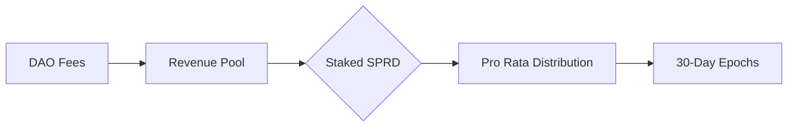

# What is Spreadly?

Spreadly revolutionizes decentralized asset management by combining structured capital formation with flexible DAO governance. Our platform enables creation of investment vehicles that balance decentralized control with professional-grade portfolio management.

## 1.1 Management Structures

Spreadly empowers organizations with flexible management options through purpose-built contracts that cater to different operational needs:

**Single Admin DAO -** A streamlined structure perfect for individual portfolio managers, featuring:
- Full treasury control through a single wallet address
- Seamless trade execution with automated fee collection
- Fair profit sharing between the trading admin and DAO token stakers
- Emergency disbandment voting, ensuring DAO token stakers can recover equitable shares of the treasury

**Multi-Admin DAO -** Designed for collaborative investment teams that need shared control:
- Equal trading privileges across multiple admin addresses
- Automated fee distribution to trade executors
- Equitable profit sharing with DAO token stakers
- Protected by emergency voting and distribution, just as Single Admin DAOs

**Governance DAO -** A fully decentralized model built for community-driven management:
- Democratic control through token-based voting
- Comprehensive proposal system for DAO settings and trades
- Flexible voting power delegation to any address on Sui
- Transparent profit distribution to all token stakers
- Community-controlled emergency procedures for treasury protection

## 1.2 Key Protocol Components

### 1.2.1 Capital Formation Process

**Phase 1 - SPRD Bonding Curve**
- Initiates and configures a DAO, collects the launch fee in SPRD tokens, then adds the DAO to the bonding curve
- Price discovery through active trading on the bonding curve, with all transactions conducted in SPRD
- Progresses to the asset deposition phase once the DAO reaches the target SPRD threshold on the curve
- Transitions to the active market trading through automatic liquidity provision on Cetus DEX
- Establishes a SPRD trading pair for the DAO token, creating essential pricing for the asset deposition phase

**Phase 2 - Asset Deposition**  
- Configurable deposit windows (24-72hrs)  
- Multi-asset collateralization  
- Chainlink-based valuation  
- Proportional token minting  

### 1.2.2 Treasury Operations

**Asset Management Matrix**

| Capability                    | Admin DAOs                    | Governance DAOs                |
|:-----------------------------|:------------------------------|:------------------------------|
| Spot Trading                 | Whitelisted Pairs on DeepBook & Cetus            | All Pairs on DeepBook & Cetus                    |
| Derivatives                  | Sudo Perps                    | Sudo Perps                    |
| Lending/Borrowing           | SuiLend                       | SuiLend                       |
| NFT Trading                  | ❌                           | TradePort                     |
| External Withdrawals         | ❌                           | ✅                           |
| Disbandment                  | ✅                           | ✅                           |

### 1.2.3 Staking & Governance

**Protocol Governance:** Staked SPRD holders can participate in governance decisions regarding the following
    - Setting minimum SPRD thresholds for launching new bonding curves
    - Determining required SPRD fees for proposal creation, trade execution, and proposal comments
    - Adjusting the treasury/revenue distribution ratio for total revenues
    - Modifying profit distribution schedules and epoch lengths
    - Managing whitelisted assets for DeepBook and Cetus trading

**Economic Benefits:** Staked SPRD holders earn protocol revenue through two distinct channels:
    * **SPRD Protocol Fees:** SPRD generated from DAO activities across the platform, including: DAO launch fees, proposal creation & commenting fees, trade execution fees.
    - **DAO Trading Fees:** Revenue from successful trades executed by DAOs, denominated in the traded currency.

Both revenue streams are distributed between treasury and revenue pools according to the DAO config. Staked SPRD holders receive their share of the revenue pools through regular epoch-based distributions, proportional to their staked amount.

**DAO Governance**  
- Treasury disbandment procedures  
- Proposal lifecycle management:  
  - Creation thresholds  
  - Voting windows  
  - Execution safeguards  
- Configuration migration paths

### 1.2.4 Revenue Framework

**Platform-Level Economics**  

**DAO-Specific Distribution**  
- Performance-based rewards, only on profitable trades  
- Stakers receive a proportional amount of revenue based for each epoch 